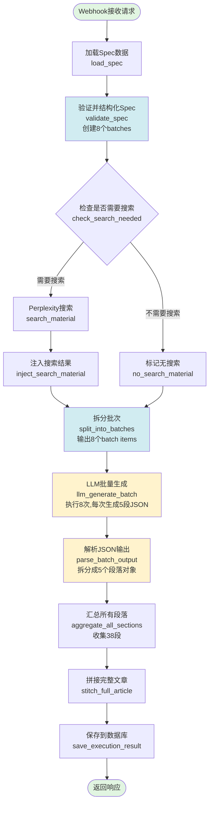

# Spec驱动写文章 - 完整工作流程图



## 节点说明

### 1. webhook_receive (Webhook触发器)
- **类型**: n8n-nodes-base.webhook
- **功能**: 接收HTTP POST请求
- **输入参数**: topic, keywords, refMaterialId, coverPromptId, totalWordCount, taskId, useSearch

### 2. load_spec (数据加载)
- **类型**: n8n-nodes-base.postgres
- **功能**: 从数据库加载style_analyses和image_prompts数据
- **SQL**: JOIN查询,一次性获取所有需要的数据

### 3. validate_spec (Spec结构化)
- **类型**: n8n-nodes-base.code
- **功能**:
  - 将数据库数据转换为分层spec结构
  - 创建8个batches (每batch包含5个blueprints)
- **输出**:
  - spec (完整规范)
  - batches (8个批次数组)
  - execution_context (执行上下文)

### 4. check_search_needed (条件判断)
- **类型**: n8n-nodes-base.if
- **功能**: 根据useSearch参数决定分支
- **条件**: `{{ $json.spec.meta.use_search }}`

### 5. search_material (网络搜索)
- **类型**: Perplexity AI节点
- **功能**: 搜索相关素材
- **输入**: topic + keywords

### 6. inject_search_material (注入搜索结果)
- **类型**: n8n-nodes-base.code
- **功能**: 将搜索结果添加到execution_context

### 7. no_search_material (无搜索标记)
- **类型**: n8n-nodes-base.code
- **功能**: 标记search_material为null

### 8. split_into_batches (批次拆分)
- **类型**: n8n-nodes-base.code
- **功能**: 将batches数组拆分成8个独立items
- **输出**: 8个items,每个包含:
  - batch (包含5个blueprints)
  - spec (完整规范)
  - execution_context

### 9. llm_generate_batch (LLM批量生成) ⭐
- **类型**: @n8n/n8n-nodes-langchain.chainLlm
- **功能**: 一次性生成5段文字
- **执行次数**: 8次 (对应8个batches)
- **输出格式**: JSON数组
```json
[
  {"p_id": "1/38", "text": "..."},
  {"p_id": "2/38", "text": "..."},
  {"p_id": "3/38", "text": "..."},
  {"p_id": "4/38", "text": "..."},
  {"p_id": "5/38", "text": "..."}
]
```

### 10. parse_batch_output (JSON解析) 📋
- **类型**: n8n-nodes-base.code
- **功能**:
  - 解析LLM输出的JSON
  - 拆分成5个独立段落对象
  - 添加metadata (word_count, index等)
- **输出**: 8×5 = 40个items (实际38段+2段空)

### 11. aggregate_all_sections (汇总段落)
- **类型**: n8n-nodes-base.code
- **功能**:
  - 收集所有40个items
  - 按index排序
  - 过滤掉空段落
  - 计算统计信息

### 12. stitch_full_article (文章拼接)
- **类型**: n8n-nodes-base.code
- **功能**: 将38段拼接成完整文章markdown

### 13. save_execution_result (保存结果)
- **类型**: n8n-nodes-base.postgres
- **功能**:
  - 插入task_executions记录
  - 更新tasks状态为completed

## 数据流示例

```
Webhook输入:
{
  "topic": "年轻人不装了，选择躺平",
  "keywords": "及时行乐，放弃努力...",
  "refMaterialId": "xxx",
  "totalWordCount": 4000,
  "useSearch": true
}

↓

Batch 1 (Node 9输出):
{
  "batch": {
    "batch_id": 1,
    "blueprints": [
      {p_id: "1/38", action: "...", word_count_target: "200±20字"},
      {p_id: "2/38", action: "...", word_count_target: "10±5字"},
      {p_id: "3/38", action: "...", word_count_target: "120±20字"},
      {p_id: "4/38", action: "...", word_count_target: "80±15字"},
      {p_id: "5/38", action: "...", word_count_target: "80±15字"}
    ]
  },
  "spec": { identity: {...}, lexical: {...}, ... }
}

↓

LLM输出 (Node 9):
[
  {"p_id": "1/38", "text": "那块绿水鬼..."},
  {"p_id": "2/38", "text": "奋斗三件套，坍塌了"},
  {"p_id": "3/38", "text": "老陈的眼白泛着黄..."},
  {"p_id": "4/38", "text": "外滩的落地窗前..."},
  {"p_id": "5/38", "text": "时代的沙漏颠倒..."}
]

↓

解析后 (Node 10):
[
  {p_id: "1/38", text: "...", word_count: 271, index: 0},
  {p_id: "2/38", text: "...", word_count: 9, index: 1},
  {p_id: "3/38", text: "...", word_count: 132, index: 2},
  {p_id: "4/38", text: "...", word_count: 134, index: 3},
  {p_id: "5/38", text: "...", word_count: 102, index: 4}
]
```

## 关键设计点

1. **批次处理**: 8个batches × 5段/batch = 40个sections (实际38段)
2. **一次生成多段**: 每次LLM调用生成5段,而不是1段
3. **JSON格式输出**: 便于解析和验证
4. **无状态节点**: 每个节点独立处理,无跨batch上下文传递
5. **并行执行**: 8个batches可以并行处理(如果资源允许)

## 待创建节点

- [x] Node 1-9: 已完成
- [ ] Node 10: parse_batch_output
- [ ] Node 11: aggregate_all_sections
- [ ] Node 12: stitch_full_article
- [ ] Node 13: save_execution_result
```
